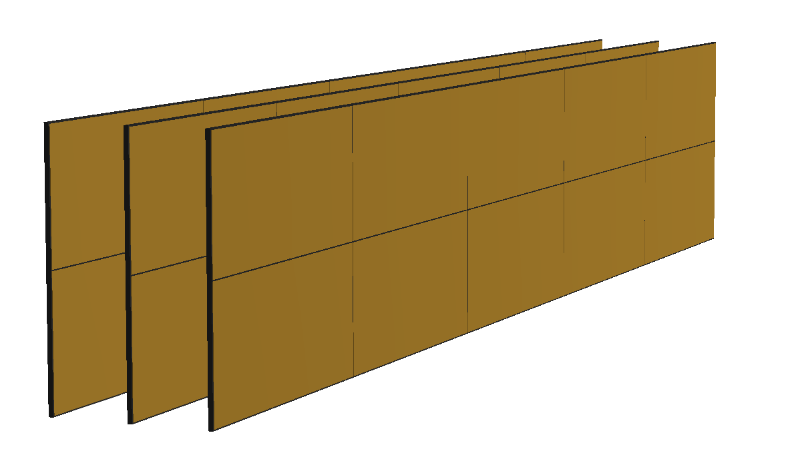

# Limadou-Event-Display


## Event Display

The event display is managed by the Display class (Event_Display/src/Display.h).
Elements of the detector and tracks are visualized using dedicated classes.

To display the detector geometry, start a ROOT session in Event_Display/scripts and run

```bash
.x LoadMacros.cpp 
Geometry geometry
Display display(geometry, 10., 10., 1.)
display.Run()
```


